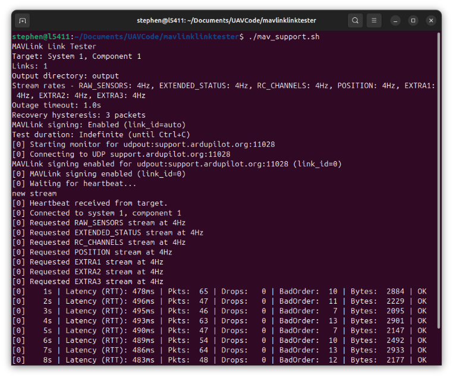
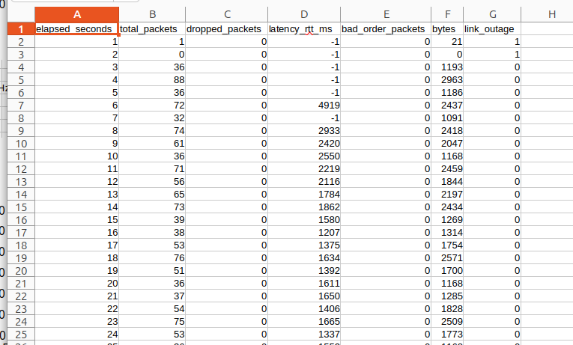
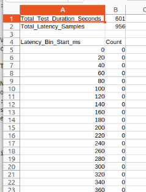

# The MAVLink Link Tester (MLLT)

A professional tool for characterizing the reliability and latency of MAVLink connections. Tests MAVLink links for packet loss, latency, and outages.



## Features

- **Multi-link testing**: Monitor multiple MAVLink connections concurrently
- **Comprehensive metrics**: Track packet loss, latency, out-of-order packets, and link outages
- **Multiple transport types**: Support for UDP, TCP, and serial connections
- **Configurable stream rates**: Control MAVLink stream rates for different data types
- **MAVLink 2.0 signing**: Full support for authenticated MAVLink connections
- **CSV output**: Detailed metrics exported to CSV files for analysis
- **Real-time monitoring**: Live statistics during testing

## Installation

### Prerequisites

- Python 3.9 or higher
- Poetry 2.2.1 or higher (for dependency management)

### Setup

**Option 1: Install from GitHub releases (recommended for users)**

```bash
# Install the latest release (replace VERSION with actual version number, e.g., 0.9.0)
pip install https://github.com/stephendade/mavlinklinktester/releases/download/vVERSION/mavlinklinktester-VERSION-py3-none-any.whl

# Example for version 0.9.0:
pip install https://github.com/stephendade/mavlinklinktester/releases/download/v0.9.0/mavlinklinktester-0.9.0-py3-none-any.whl
```

Check the [releases page](https://github.com/stephendade/mavlinklinktester/releases) for the latest version number.

**Option 2: Install to your system/active environment**

```bash
# Clone the repository
git clone https://github.com/stephendade/mavlinklinktester.git
cd mavlinklinktester

# Install package to your current Python environment
# This makes the mavlink-link-tester.py command available on your PATH
pip install -e .
```

**Option 3: Use Poetry for development (recommended for developers)**

```bash
# Clone the repository
git clone https://github.com/stephendade/mavlinklinktester.git
cd mavlinklinktester

# Install dependencies with Poetry (creates isolated virtual environment)
poetry install

# For development with testing and code quality tools
poetry install --with dev
```

Note: With Poetry, the command is only available via `poetry run mavlink-link-tester.py` unless you also run `pip install -e .` in your system environment.

## Usage

### Basic Usage

```bash
mavlink-link-tester.py --system-id 1 --component-id 1 <CONNECTION>
```

If working within a Poetry development environment, use ``poetry run mavlink-link-tester.py ...`` instead

### Connection Strings

- **UDP Input (Server)**: `udpin:0.0.0.0:14550` - Listen for incoming UDP connections
- **UDP Output (Client)**: `udpout:192.168.1.100:14550` - Connect to remote UDP endpoint
- **TCP Client**: `tcp:192.168.1.100:5760` - Connect to TCP endpoint
- **TCP Server**: `tcpin:192.168.1.100:5760` - Listen for incoming TCP connections
- **Serial**: `/dev/ttyUSB0:57600` - Connect via serial port

### Examples

**Test single UDP link:**
```bash
mavlink-link-tester.py --system-id 1 --component-id 1 udpin:0.0.0.0:14550
```

**Test multiple links simultaneously:**
```bash
mavlink-link-tester.py --system-id 1 --component-id 1 \
  udpin:0.0.0.0:14550 \
  udpout:192.168.1.100:14551
```

**Test with custom duration:**
```bash
mavlink-link-tester.py --system-id 1 --component-id 1 \
  --duration 300 \
  udpin:0.0.0.0:14550
```

**Test serial connection:**
```bash
mavlink-link-tester.py --system-id 1 --component-id 1 \
  /dev/ttyUSB0:57600
```

**Test with custom stream rates:**
```bash
mavlink-link-tester.py --system-id 1 --component-id 1 \
  --all-rates 4 \
  /dev/ttyACM0:115200
```

**Test with custom individual stream rates:**
```bash
mavlink-link-tester.py --system-id 1 --component-id 1 \
  --all-rates -1 \
  --rate-raw-sensors 10 \
  --rate-position 5 \
  /dev/ttyACM0:115200
```

**Test with MAVLink 2.0 signing:**
```bash
mavlink-link-tester.py --system-id 1 --component-id 1 \
  --signing-passphrase mysecretkey \
  udpin:0.0.0.0:14550
```

## Command-Line Options

### Required Arguments

- `--system-id`: Target system ID (autopilot)
- `--component-id`: Target component ID (autopilot)

### Optional Arguments

- `--duration`: Test duration in seconds (default: run indefinitely until Ctrl+C)
- `--outage-timeout`: Outage detection timeout in seconds (default: 1.0)
- `--recovery-hysteresis`: Number of consecutive packets required to exit outage (default: 3)
- `--output-dir`: Output directory for CSV files (default: `output`)

### Stream Rate Control

Control the frequency of different MAVLink message streams (in Hz):

- `--rate-raw-sensors`: RAW_SENSORS stream rate (default: 4 Hz)
- `--rate-extended-status`: EXTENDED_STATUS stream rate (default: 4 Hz)
- `--rate-rc-channels`: RC_CHANNELS stream rate (default: 4 Hz)
- `--rate-position`: POSITION stream rate (default: 4 Hz)
- `--rate-extra1`: EXTRA1 stream rate (default: 4 Hz)
- `--rate-extra2`: EXTRA2 stream rate (default: 4 Hz)
- `--rate-extra3`: EXTRA3 stream rate (default: 4 Hz)

### MAVLink Signing

- `--signing-passphrase`: MAVLink 2.0 signing passphrase (hashed with SHA-256)
- `--signing-link-id`: MAVLink 2.0 signing link ID (default: use monitor link_id)

## Output

The tool generates CSV files of the per-second link statistics in the specified output directory
(default: `output/`) containing:

- `elapsed_seconds`: Time elapsed since test start
- `received_packets`: Number of packets received
- `dropped_packets`: Number of dropped packets
- `latency_rtt_ms`: Round-trip-time latency in milliseconds
- `bad_order_packets`: Number of packets received out of sequence
- `bytes`: Bytes received
- `link_outage`: Boolean indicating if link is in outage state



A csv file containing a histrogram of the latency is also generated in the same folder.



CSV files are named with the connection string and timestamp for easy identification.

### Output Definitions

A packet is counted as ``bad_order_packets`` of it arrives out-of-sequence within 50 packets of
the expected sequence. After this point, the packet is counted as ``dropped_packets``.

The ``link_outage`` is set to ``1`` is no packets are recieved in ``--outage-timeout`` seconds.
It is set back to ``0`` when at least ``--recovery-hysteresis`` packets are recieved.

Received MAVLink packets with a bad CRC are counted as ``dropped_packets``.

Under high loss scenarios (>20% loss), ``dropped_packets`` may not be accurate, due to an
inability to distinguish large loss gaps. For example a received sequence of ``1, 2, 3, 50, 4``
will not be able to know if the gap between ``50`` and ``4`` is 201 packets or some muliple (ie. 456, 711).

For a more accurate loss measurement, it is recommended to test against a known-good link and compare the number
of received packets.

The ``bytes`` field will only count the bytes from ``received_packets``. It will not count any bad or corrupted data.

The ``latency_rtt_ms`` will be ``-1`` if a ping response is not received in a one-second time period.


## Development

### Running Tests

The project includes a comprehensive test suite using pytest.

```bash
# Run all tests
poetry run pytest

# Run with coverage report
poetry run pytest --cov=src --cov-report=html

# Run specific test file
poetry run pytest tests/test_link_monitor.py

# Run with verbose output
poetry run pytest -v
```

### Code Quality

The project uses flake8 for linting, mypy for type checking, and vulture for dead code detection:

```bash
# Run linting
poetry run flake8 mavlinklinktester/ tests/

# Run type checking
poetry run mypy mavlinklinktester/

# Check for dead code
poetry run vulture mavlinklinktester/ --min-confidence 80
```

### Releasing new versions

The CI will build a new release, based on the following commands:

```bash
poetry version patch  # or minor/major
git add pyproject.toml
git commit -m "Bump version to $(poetry version -s)"
git tag v$(poetry version -s)
git push origin main --tags
```

This must be done directly to the main branch.


## License

This project is licensed under the GNU General Public License v3.0 or later. See the LICENSE file for details.

## Author

**Stephen Dade**  
Email: stephen_dade@hotmail.com  
GitHub: [@stephendade](https://github.com/stephendade)

## Contributing

Contributions are welcome! Please feel free to submit issues or pull requests on GitHub.
